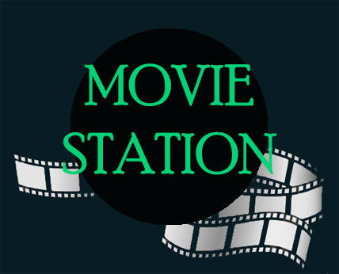
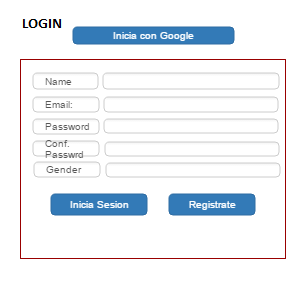
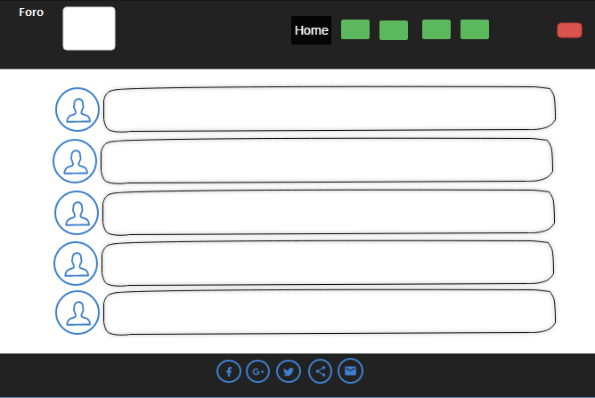
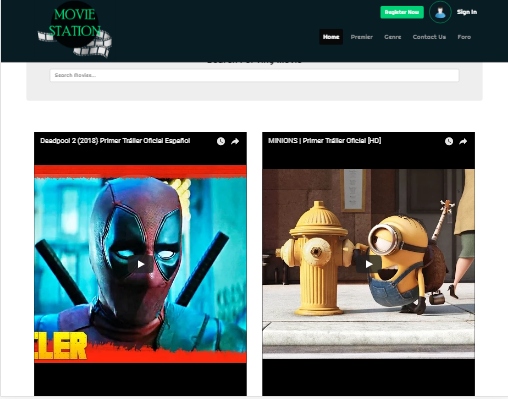
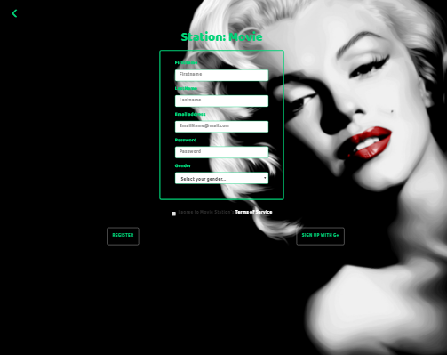
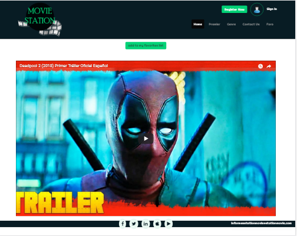
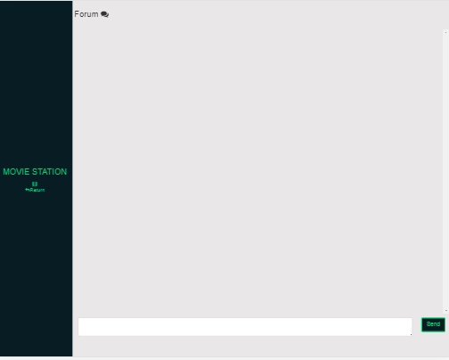

# PROYECTO: MOVIE STATION
# BAJO EL LEMA: Disfruta como en el cine...

 

# NOMBRE DE PARTICIPANTES
	
*   Mariela Cerna Peralta: UX-UI
    - Encargada del desarrollo de entrevistas y maquetación creación de logo y definición del color, recopilación de información sobre experiencias de usuario, anotaciones sobre sus requerimientos para mejorar su experiencia futura, se utilizó herramientas de fácil alcance como papel y lápiz para dibujar los sketches(diseño básico), 

*   Franshesca Quezada: UX-UI. 
    - Encargada de maquetación, definición de color, tipografías y definición de nombre junto con el equipo de trabajo, además de recopilar información sobre experiencias de usuario, utilizó herramientas de fácil alcance como papel y lápiz para dibujar los sketches(diseño básico).

*   Claudia Garibotto: UX-UI. 
    - Encargada de la funcionalidad del producto, además junto con el equipo de UX, UI, recopilar información sobre las experiencias de los usuarios, analizar y llegar a un punto medio base donde se desarrolla la idea.

*   Yanina Mercado.
    - Encargada de la funcionalidad del producto, además junto con el equipo de UX, UI, recopilar información sobre las experiencias de los usuarios, analizar y llegar a un punto medio base donde se desarrolla la idea.

### CRONOGRAMA DE ESTUDIOS.
 

    
### METODOS DE LEVANTAMIENTO DE INFORMACION.
*   Entrevista
    -   Directamente con el usuario.
    -   Vía wasap y audios.

*   Herramienta de trabajo.
    -   Celular lápiz y papel.
 
### NUESTRO CLIENTE NOS INFORMO ALGUNOS PUNTOS BASICO.
•   Uso de Api Open Movie DataBase.
•   Guardar videos.

### ¿QUÉ SE REQUIERE?
•   Trabajar en equipos
•   Tener una planificación
•   La definición del diseño
•   Desplegar el producto en Github Pages
•   Opcional uso de perfil por usuario.
•   Respaldar la idea del producto.

### PROCESOS DE DISEÑO DE LA EXPERIENCIA
-   Se analiza el fondo un tema que creemos podría ser viable, se llega a un acuerdo y se procede a entrevistar.
-   La experiencia de usuario es enriquecedora, se procede a realizar los diseños básicos solo papel y lápiz para dibujar los sketches y volver a revisarlo una o las veces que sea necesario hasta que el producto tome forma y usabilidad.
-   Volvemos a entrevistar de forma más detallada y así profundizar cual es el factor determinante que mejorara la experiencia de usuario.
-   Se procede a diseñar los maquetados, cada una de las vistas desktop Tablet y Mobile.
-   Luego se le adiciona funcionalidad, rapidez y simpleza, que sea entendible al usuario y su experiencia sea enriquecedora. Se realizaron las pruebas de funcionalidad.

### Lista de SKETCHES.

* SPLASH  
 

* HOME  
 

* LOGIN  
 

* PROFILE  

* FORO  

### Herramientas de trabajo.
*   Utilizamos framework Bootstrap 3.1
*   Programación en Jquery.
*   Uso de Firebase para autenticación.
*   HTML5.
*   @media query.

### ELEMENTOS QUE SE UTILIZACION EN LA CREACION DE APP Y WEB STATION MOVIE.
*   Se creó un logotipo y en Photoshop.
*   Definición de paleta de colores y diseño de cada una de las views.
*   Se utiliza una nueva herramienta de base de datos online, Firebase, que almacena la base de datos en tiempo real, así como el login está vinculado directo con la cuenta de usuario en gmail.
*   Antes de iniciar un registro previo las vistas están compuestas por:
*   Splash.
*   Home.
*   Login. 
*   Profile.
*   Foro.
*   Modal de autenticación

### PRESENTACION DEL PRODUCTO.
*   Se crea un repositorio.
*   Se crea página gh-pages para guardar información de commit adicionales por cada colaborador.
*   Trabajo en equipo

## USO DE Api OPEN MOVIE DATABASE y Firebase

* La utilización de firebase, facilita al usuario el uso del login, porque evita tener que llenar el formulario de registro, puede acceder directo con su cuenta de usuario de gmail.

* Esta api, nos da acceso a las películas, data con la que se trabaja la aplicación Movie Station, y su funcionalidad de búsquedas de película.

## VISTAS STATION-MOVIE

-   Vista inicial
    En esta se presenta el logo en una ventana splash con una duración de 3 segundos.
-   Vista Home
    Vista donde muestra todas las películas y libre acceso para realizar búsquedas de películas.
-   Vista Login    
    Acceso a registro mediante un formulario, nos muestra dos opciones, el registro directo con cualquier cuenta y el registro con GMAIL.
-   Vista Profile    
    En esta vista esta almacenadas todas las películas que el usuario guarda, además presenta un buscador donde puedes seleccionar la película que quieras volver a ver directamente desde tu perfil. 
-   Vista Foro    
    En esta vista es posible realizar un chat en tiempo real, con usuarios que les guste la película o que tengan algo que comentar sobre ella. 

 

## Vistas de la App. MOVIE STATION.

